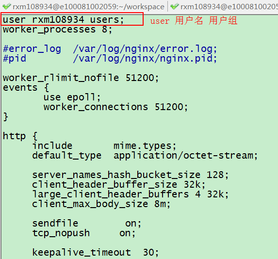
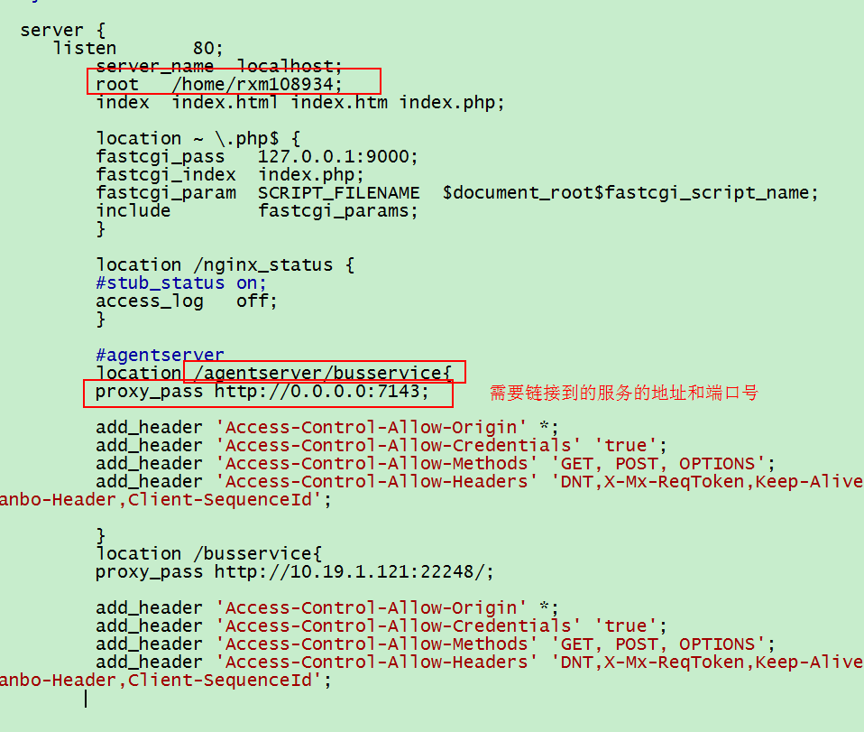
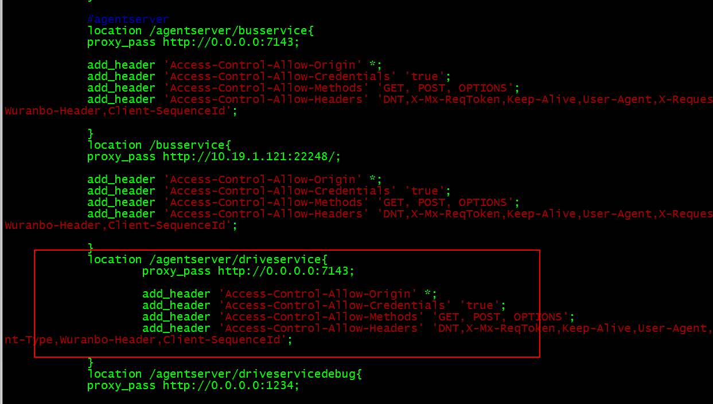
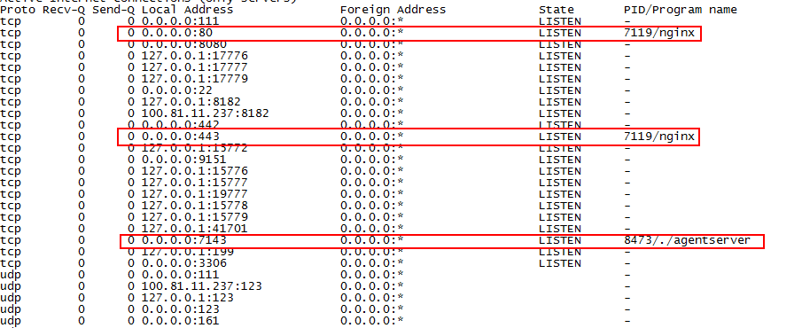
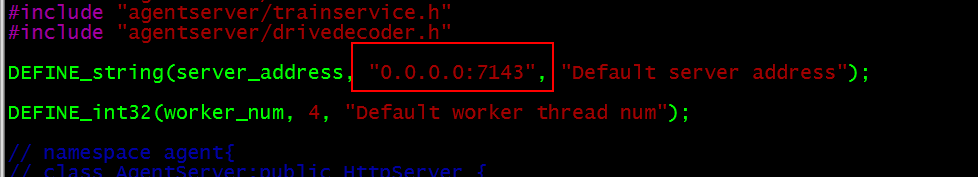
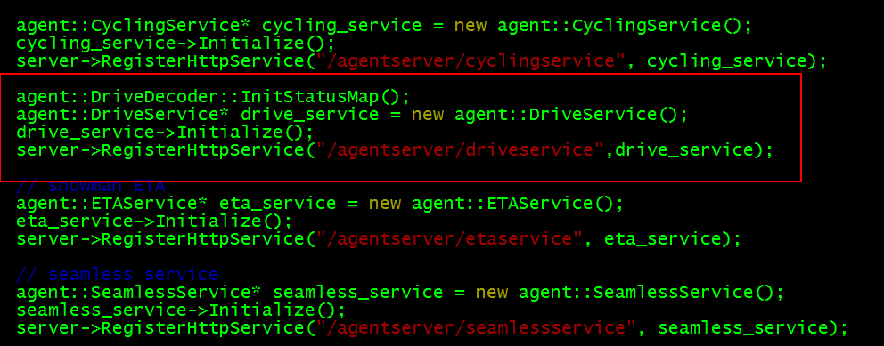
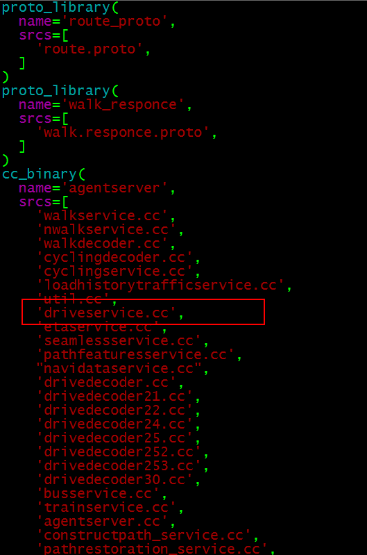

#agentserver 配置说明#

###Nginx 工程配置###
agentserver是通过反向代理的方式来实现的。

反向代理方式实际上就是一台负责转发的代理服务器，貌似充当了真正服务器的功能，但实际上并不是，代理服务器只是充当了转发的作用，并且从真正的服务器那里取得返回的数据。nginx完成的就是这样的工作。

下面看看nginx需要做哪些配置：

* ####设置user	####
`user rxm108934 users;`（这个设置非常重要，很多时候就是因为user没有设置好导致运行不正确）

	`worker_processes 8;`

* ####设置root,location,proxy_pass ####
root 是文件存放的主目录

	location是用来定义url路径的

	proxy_pass 是url链接的agentserver服务

* ####添加需要的service 到nginx ####
到[nginx.conf](nginx.conf)文件中copy 相应的service代码(譬如下图中driveservice)，修改location即可完成添加。

* ####启动nginx####
启动nginx的时候一定要以当前用户启动，启动之后运行下面命令查看：

`netstat -tulnp`

如果可以看到有两个nginx（一个80，一个443），那么用户设置成功，启动正确。

到此，nginx设置完成。接下来设置agentserver

***

### agentserver 设置###

* 设置agentserver的端口号

这个设置和nginx中的服务建立连接

* 在agentserver中添加service类

* blade build 编译 agentserver
为blade build添加配置

配置添加完成之后，使用命令：

`blade build`

开始编译

### agentserver使用说明(俊惠整理)###
升级解码器时：

* ####后台####

* 开发：
将decoder文件拷贝到/home/www/TestTools/agentserver/onlinenavi/src/Decoder25下，运行命令：**blade build**，确认编译通过。
如果需要下发给前端新的JSON参数，请更改/home/www/TestTools/agentserver里的route.proto文件。执行blade build，生成的proto文件在`./build64_release/agentserver/`下。
请将route.pb.h或route.pb.cc拷贝到/home/www/TestTools/agentserver里。
需要下发给前端的参数，请更改drivedecoder25.h和drivedecoder25.cc文件。
* 编译：
运行命令：blade build。生成的文件agentserver在./agentserver/build64_release/agentserver/agentserver。
* 启动服务：
kill掉现在执行的agentserver程序；
将可执行程序拷贝到：/home/www/TestTools/agentserver_online，替换路径下同名可执行文件agentserver；
启动程序：`nohup ./agentserver &`
 
* ####前端####

程序位置：/home/nginx_www

* ####crontab配置(定时执行任务)####
`/home/www/TestTools/agentserver_online/agent_server_monitor.sh`

